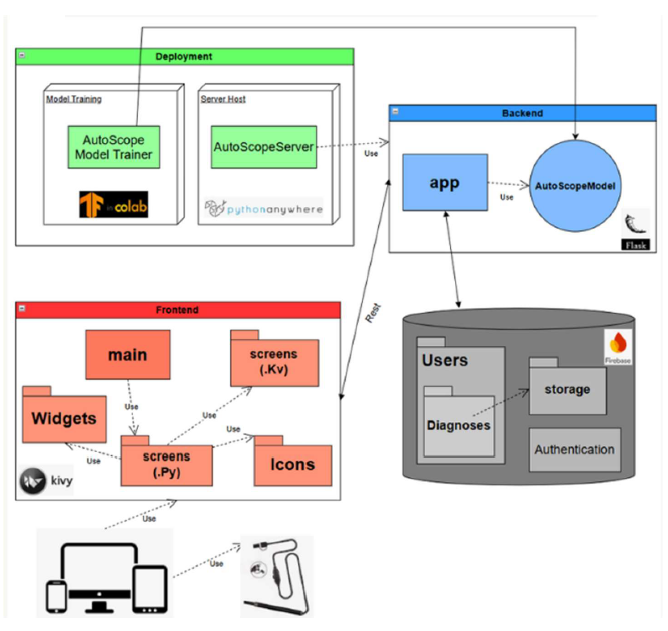
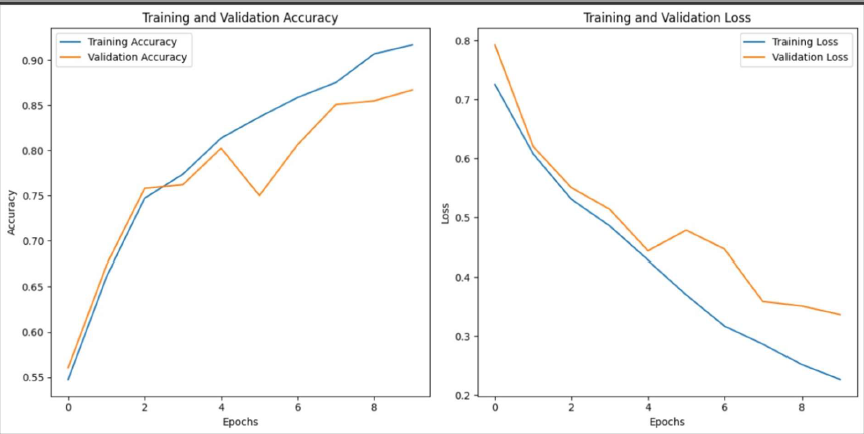

# AutoScope

## Overview
AutoScope is an innovative application designed to assist in detecting ear infections using deep learning technology. By integrating an otoscope for real-time image capture and advanced image analysis models, the app provides accurate and user-friendly early diagnostic support.

## Features
- **Real-time Ear Examination**: Capture ear images using a USB otoscope.
- **Deep Learning Analysis**: Uses a trained ResNet50 model to classify ear images as normal or infected.
- **User-Friendly Interface**: Simple and intuitive UI for image capture, analysis, and results display.
- **Data Storage**: Save analyzed images and results for later review.

## System Architecture



## Installation
### Prerequisites
- Python 3.11.0
- Kivy 2.3.1
- TensorFlow 2.10.0
- OpenCV
- Flask 3.1.0

### Setup Instructions
1. Clone the repository:
   ```bash
   git clone https://github.com/ndvp39/autoscope.git
   ```
2. Install dependencies:
   ```bash
   pip install -r requirements.txt
   ```
3. Run the application:
   ```bash
   python main.py
   ```

## Model Training
- The deep learning model is trained using **ResNet50** for ear infection classification.
- Dataset used: **415 infected images, 590 normal images**.
- Class weights were optimized for better learning performance.
- Model evaluation:




